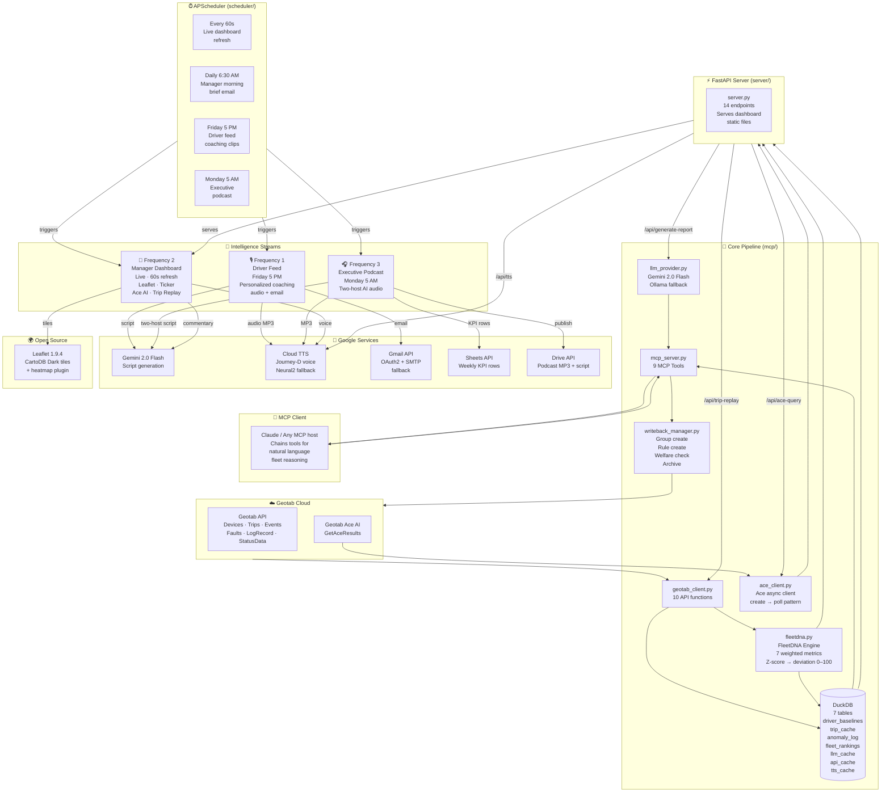

# GEOPulse — Architecture

> One fleet brain. Three personalized intelligence streams.  
> Behavioral fingerprinting → MCP reasoning → automated broadcast.

---

## System Diagram



---

## Component Reference

### `mcp/geotab_client.py`
Authenticated Geotab REST wrapper. Manages session tokens with auto-reauth. Exposes 10 public functions:

| Function | TypeName / Method |
|---|---|
| `get_live_positions()` | `DeviceStatusInfo` |
| `get_live_events(from_version)` | `GetFeed` → `ExceptionEvent` |
| `get_driver_trips(id, days)` | `Trip` |
| `get_driver_exceptions(id, days)` | `ExceptionEvent` |
| `get_active_faults()` | `FaultData` (deduped) |
| `get_all_drivers()` | `User` |
| `get_all_devices()` | `Device` |
| `create_group(name, ids)` | `Add` → `Group` |
| `create_rule(name, type, id)` | `Add` → `Rule` |
| `get_kpi_data(entity, days)` | OData `VehicleKpi_Daily` |

---

### `mcp/fleetdna.py` — Behavioral Fingerprinting

Builds a 90-day statistical baseline for each entity (driver or vehicle in demo DBs). Deviation score formula:

$$\text{score} = \frac{\sum_{m} w_m \cdot |z_m|}{\sum_{m} w_m} \times 100$$

where $z_m = \frac{x_m - \mu_m}{\sigma_m}$ and weights are:

| Metric | Weight |
|---|---|
| `max_speed` | 2.0 |
| `avg_speed` | 1.5 |
| `idle_ratio` | 1.2 |
| `trip_distance` | 1.0 |
| `daily_distance` | 1.0 |
| `trip_duration` | 0.8 |
| `daily_trips` | 0.5 |

Output: deviation score 0–100. Score > 70 = anomalous; triggers welfare check suggestion.  
Auto-detects demo databases (no real driver IDs) and falls back to per-device grouping.

---

### `mcp/duckdb_cache.py` — Local Analytics Cache

Seven persistent tables in `geopulse.duckdb`:

| Table | Contents |
|---|---|
| `driver_baselines` | 90-day μ/σ per metric per entity |
| `trip_cache` | Normalized trip records with computed metrics |
| `anomaly_log` | Timestamped deviation scores + trigger events |
| `fleet_rankings` | Weekly fuel / safety / compliance ranks |
| `llm_cache` | Gemini response cache (prompt hash → response) |
| `api_cache` | Geotab API response cache (TTL: 5 min) |
| `tts_cache` | TTS audio cache (text hash → base64 MP3) |

---

### `mcp/mcp_server.py` — 9 MCP Tools

Exposes fleet intelligence as an MCP server that any MCP-compatible client (Claude, Cursor, custom agent) can call:

| # | Tool | Write-capable |
|---|---|---|
| 1 | `get_fleet_overview` | |
| 2 | `get_driver_dna` | |
| 3 | `find_anomalous_drivers` | |
| 4 | `get_fuel_analysis` | |
| 5 | `get_safety_events` | |
| 6 | `query_fleet_data` | |
| 7 | `create_group` | ✅ |
| 8 | `create_coaching_rule` | ✅ |
| 9 | `generate_fleet_narrative` | |

> **Note:** `mcp_server.py` uses `importlib` to resolve the naming collision between the local `mcp/` package and the pip-installed `mcp` library.

---

### `server/server.py` — FastAPI Backend

Serves the manager dashboard static files and exposes 14 endpoints:

| Method | Path | Purpose |
|---|---|---|
| GET | `/` | Landing page |
| GET | `/dashboard` | Dashboard static files |
| GET | `/api/live-positions` | All vehicles + live positions + FleetDNA scores |
| GET | `/api/live-events` | Exception event feed with version token for polling |
| GET | `/api/driver/{entity_id}` | Full FleetDNA profile: baseline + today + weekly delta |
| GET | `/api/anomalies` | Entities above deviation threshold, ranked |
| POST | `/api/generate-commentary` | Gemini sportscaster narration + TTS audio (base64 MP3) |
| POST | `/api/tts` | Text → speech (Journey-D default, Neural2-D fallback) |
| POST | `/api/write-back/group` | Create Geotab group + assign vehicle IDs |
| POST | `/api/send-mail` | Manager brief email with optional audio attachment |
| POST | `/api/ace-query` | Natural-language question → Geotab Ace (Gemini fallback) |
| POST | `/api/generate-report` | AI Markdown incident/coaching report |
| GET | `/api/trip-replay/{device_id}` | GPS breadcrumbs for trip animation |
| GET | `/health` | Liveness check |
| POST | `/api/tts` | Text → base64 MP3 (Journey/Neural2 voices) |
| GET | `/health` | Liveness check |

---

### `frequencies/` — Output Pipelines

| File | Schedule | Output |
|---|---|---|
| `driver_feed.py` | Friday 5 PM | Per-driver HTML email + 90s TTS coaching MP3 |
| `manager_email.py` | Daily 6:30 AM | Morning brief HTML email with top anomalies |
| `exec_podcast.py` | Monday 5 AM | 5-min two-host MP3 + transcript to Drive + Sheets |

---

### `scheduler/cron_jobs.py` — APScheduler Jobs

```
Every 60s   → live dashboard refresh (device status + exception feed)
Daily 6:30  → manager morning brief email
Friday 5PM  → driver feed (coaching audio + emails)
Monday 5AM  → executive podcast (generate → TTS → publish)
```

---

### `mcp/ace_client.py` — Geotab Ace AI

Async client for Geotab's conversational intelligence API:

```
create_chat() → get chat_id
send_prompt(chat_id, text) → submit query  
poll_result(chat_id) → wait for answer (max 30s, 1s intervals)
```

Falls back to local Gemini with cached fleet context snapshot when `GetAceResults` is unavailable (no Ace licence on demo DB).

---

### `mcp/llm_provider.py` — LLM Abstraction

Unified interface for two providers, selected via `LLM_PROVIDER` env var:

| Provider | Model | SDK |
|---|---|---|
| `gemini` (default) | `gemini-2.0-flash` | `from google import genai` |
| `ollama` | `llama3.2` (default) | REST `POST /api/generate` |

All responses cached in DuckDB `llm_cache` by prompt hash to minimize API costs.

---

### `addin/js/main.js` — Fleet Map

Actual renderer: **Leaflet 1.9.4** + CartoDB Dark Matter tiles, loaded unconditionally (no API key required). Also uses `leaflet.heat` for density heatmap.

`addin/js/map.js` contains an unloaded Google Maps alternative (defines `initMap()` with a custom 12-rule dark style), but neither `addin/index.html` nor `dashboard/index.html` include it. It can be activated in future by adding the Maps JS API script tag and swapping the `<script>` reference.

Markers use directional bearing icons colour-coded by deviation score:
- 🟢 Green: score 0–40 (normal)
- 🟡 Yellow: score 40–70 (watch)
- 🔴 Red: score 70+ (anomalous)

---

## Data Flow Summary

```
Geotab API
    ↓  10 functions (geotab_client.py)
DuckDB cache  ←→  FleetDNA engine (Z-score baselines)
    ↓
MCP Server (9 tools)  ←→  Claude / MCP client
    ↓
FastAPI server (14 endpoints)
    ↓
┌──────────────────────┬──────────────────────────┬──────────────────────────┐
│ Frequency 1          │ Frequency 2              │ Frequency 3              │
│ Driver coaching      │ Manager dashboard        │ Executive podcast        │
│ Gemini → TTS → Gmail │ Leaflet + Ace AI + Ticker│ Gemini → TTS → Drive     │
└──────────────────────┴──────────────────────────┴──────────────────────────┘
                                  ↕
                      Write-back to Geotab
                   (Groups · Rules · Welfare checks)
```
