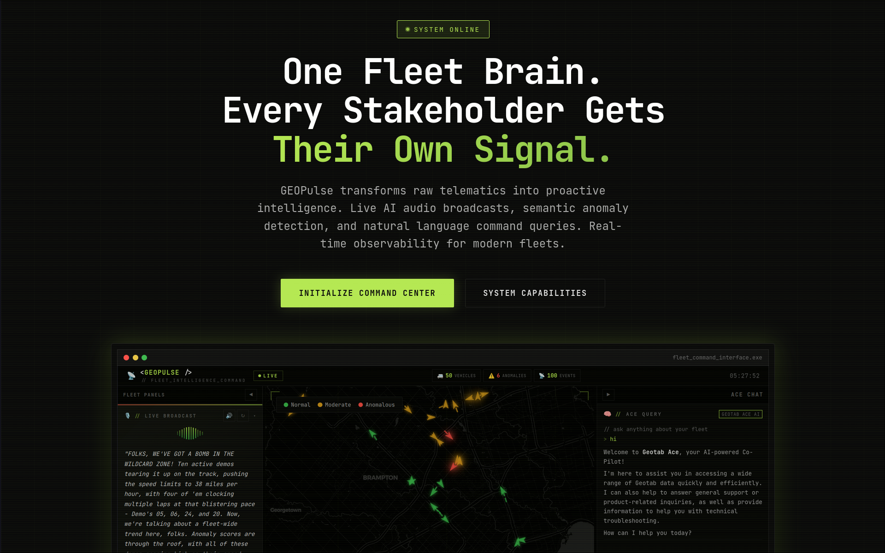
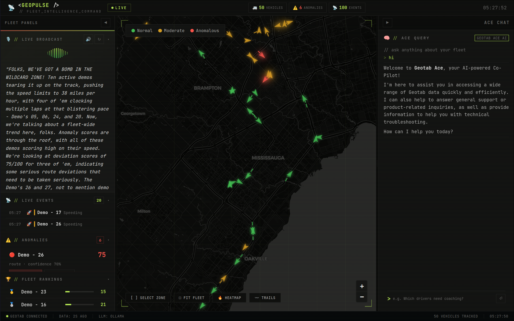

# 📡 GEOPulse

**One Fleet Brain. Every Stakeholder Gets Their Own Signal.**


> GEOPulse reads your Geotab fleet data through an MCP server, builds a behavioral fingerprint for every driver using 90 days of history, then broadcasts **three personalized intelligence streams** — a weekly driver coaching clip, a live sportscaster dashboard, and a Monday executive podcast — so that every person in your organization hears their fleet in their own format, on their own schedule.

---

## 🏗️ Architecture

```
                    ┌────────────────────────────┐
                    │      Geotab API            │
                    │  (Devices, Trips, Events,  │
                    │   Faults, DeviceStatusInfo) │
                    └────────────┬───────────────┘
                                 │
                    ┌────────────▼───────────────┐
                    │   geotab_client.py          │
                    │   9 API functions + cache   │
                    └────────────┬───────────────┘
                                 │
              ┌──────────────────┼──────────────────┐
              │                  │                   │
    ┌─────────▼────────┐ ┌──────▼──────────┐ ┌──────▼──────┐
    │   FleetDNA       │ │  DuckDB Cache   │ │ LLM Provider│
    │  Behavioral      │ │  7 tables       │ │ Gemini/     │
    │  Fingerprinting  │ │  API + TTS +    │ │ Ollama      │
    │  Z-Score Engine  │ │  LLM cache      │ │             │
    └────────┬─────────┘ └───────┬─────────┘ └──────┬──────┘
             │                   │                   │
    ┌────────▼───────────────────▼───────────────────▼──────┐
    │              MCP Server (9 Tools)                      │
    │  The AI Brain — Claude chains tools to answer queries  │
    └──────┬──────────────────┬────────────────────┬────────┘
           │                  │                    │
  ┌────────▼──────┐  ┌───────▼────────┐  ┌───────▼────────┐
  │ 🎙️ Frequency 1 │  │ 📡 Frequency 2 │  │ 🎧 Frequency 3 │
  │  Driver Feed   │  │  Manager       │  │  Executive     │
  │  Friday 5 PM   │  │  Dashboard     │  │  Podcast       │
  │  Audio + Email  │  │  Live Map +    │  │  Monday 5 AM   │
  │  per driver     │  │  Sportscaster  │  │  Two-host AI   │
  └────────────────┘  └────────────────┘  └────────────────┘
```

---

## 📸 Screenshots

### Landing Page



### Manager Dashboard — Live Map & Broadcaster



---

Prompts: [PROMPTS_USED_WHILE_VIBE_CODING.md](./PROMPTS_USED_WHILE_VIBE_CODING.md)

## ✨ Features

### 🧬 FleetDNA — Behavioral Fingerprinting

- Builds a 90-day statistical baseline per driver **or per vehicle** (auto-detects demo databases with no real driver IDs)
- 7 weighted metrics: `avg_speed` (×1.5), `max_speed` (×2.0), `trip_distance` (×1.0), `trip_duration` (×0.8), `idle_ratio` (×1.2), `daily_distance` (×1.0), `daily_trips` (×0.5)
- Compares today to _their own normal_ using Z-score per metric, combined into a weighted deviation score
- Scale: 0 (perfectly normal) → 100 (completely anomalous)
- Detects stress, fatigue, or medical events — not just rule violations
- Persists baselines and daily scores in DuckDB for trend analysis and weekly delta reporting

### 🎙️ Frequency 1: Driver Feed (Friday 5 PM)

- Personalized 90-second audio coaching clip per driver
- HTML email with metric bars (this week vs their personal average)
- Fleet rank badge, coaching tips, audio play button

### 📡 Frequency 2: Manager Dashboard (Live)

- Dark-themed real-time map — **Leaflet 1.9.4** + CartoDB Dark Matter tiles + `leaflet.heat` heatmap plugin (no API key required)
- Live sportscaster audio commentary (ESPN-style, Gemini-generated + Google Cloud TTS, auto-refreshes every 60s)
- Event ticker with real-time exception events (GetFeed streaming, per-vehicle deduplication)
- FleetDNA anomaly panel with pulsing alerts + deviation score badges
- Detail drawer: radar chart (Today vs Normal), metric breakdown, coaching tip
- One-click Welfare Check → creates Geotab Group instantly (live write-back to MyGeotab)
- **Ace AI chat**: natural-language fleet questions answered live via Geotab Ace (`GetAceResults`)
- **Report generator**: one-click AI incident or coaching report in structured Markdown
- **Trip replay**: GPS breadcrumb animation for any vehicle's most recent trip

### 🎧 Frequency 3: Executive Podcast (Monday 5 AM)

- 5-minute two-host podcast (Alex & Jamie)
- Uses real fleet data: vehicle numbers, driver names, percentages
- Structure: Cold open → Top story → Safety dive → Driver spotlight → Prediction

### 🤖 MCP Server (9 Tools)

AI-chainable tools that let Claude reason about your fleet:

| #   | Tool                       | Purpose                                                                 |
| --- | -------------------------- | ----------------------------------------------------------------------- |
| 1   | `get_fleet_overview`       | All vehicles + live positions + FleetDNA deviation scores               |
| 2   | `get_driver_dna`           | Full 90-day baseline + today's score + weekly delta for one entity      |
| 3   | `find_anomalous_drivers`   | All entities above a deviation threshold, ranked worst-first            |
| 4   | `get_fuel_analysis`        | Distance/idle rankings — identifies fuel-inefficient routes             |
| 5   | `get_safety_events`        | Exception events grouped by driver + rule type for last N hours         |
| 6   | `query_fleet_data`         | Freeform SQL against DuckDB — trips, baselines, anomaly log             |
| 7   | `create_group`             | Write-back: Add Geotab Group + assign vehicles in one call              |
| 8   | `create_coaching_rule`     | Write-back: create exception alert rule for a specific driver           |
| 9   | `generate_fleet_narrative` | Gemini narrative scoped to `driver`, `manager`, or `executive` audience |

### 🗣️ Ace AI Integration

- Natural-language queries routed to Geotab Ace API (`GetAceResults`)
- Uses async create-chat → send-prompt → poll pattern via `ace_client.py`
- Falls back to local Gemini with cached fleet context when Ace is unavailable
- Exposed at `/api/ace-query` (dashboard chat panel) and as MCP context

### 📋 Report Generation

- `/api/generate-report` produces structured Markdown incident or coaching reports
- Source data: entity's 90-day baseline + today's Z-scores + recent exception events
- Two modes: `incident` (risk assessment table, contributing factors) and `coaching` (positive reinforcement, action items)

### 🔁 Trip Replay

- `/api/trip-replay/{device_id}` fetches GPS `LogRecord` breadcrumbs for the latest trip
- Dashboard animates vehicle movement over the route with speed-based colour coding

### ✍️ Write-Back Automation

GEOPulse doesn't just read — it writes back to Geotab:

- **Morning analysis** → "Needs Attention" + "Welfare Check" groups
- **Friday driver feed** → "Week N Champions" group + coaching rules for bottom performers
- **Monday podcast** → Archive previous week's groups
- **Real-time** → Instant welfare-check group created from the dashboard anomaly panel

---

## 🔧 Geotab API Calls

| Method          | typeName / Endpoint | Key Filters                          | Used In                                                     |
| --------------- | ------------------- | ------------------------------------ | ----------------------------------------------------------- |
| `Authenticate`  | —                   | database, userName, password         | `geotab_client.py`                                          |
| `Get`           | `DeviceStatusInfo`  | —                                    | `get_live_positions()` — live positions, speed, bearing     |
| `GetFeed`       | `ExceptionEvent`    | `fromVersion`                        | `get_live_events()` — streaming events + version token      |
| `Get`           | `ExceptionEvent`    | `fromDate`, `userSearch`             | `get_driver_exceptions()` — per-entity exception history    |
| `Get`           | `Trip`              | `fromDate`, `deviceSearch`           | `get_driver_trips()` — trip metrics (distance, speed, idle) |
| `Get`           | `LogRecord`         | `deviceSearch`, `fromDate`, `toDate` | `trip_replay()` endpoint — GPS breadcrumbs                  |
| `Get`           | `FaultData`         | `faultState: Active`, `fromDate`     | `get_active_faults()` — deduped active faults per device    |
| `Get`           | `User`              | `isDriver: true` → fallback to all   | `get_all_drivers()` — driver list (demo DB safe)            |
| `Get`           | `Device`            | —                                    | `get_all_devices()` — all vehicles                          |
| `Add`           | `Group`             | `name`, `parent`                     | `create_group()` — welfare check / champions groups         |
| `Add`           | `Rule`              | `name`, `condition`                  | `create_rule()` — coaching exception rules                  |
| `GetAceResults` | —                   | `functionName`, `functionParameters` | `ace_client.py` — natural-language SQL via Ace AI           |
| OData           | `VehicleKpi_Daily`  | `$filter=Date ge …`                  | `get_kpi_data()` — weekly KPI aggregates via Data Connector |

---

## 🌐 FastAPI Endpoints

| Method | Endpoint                       | Description                                                                |
| ------ | ------------------------------ | -------------------------------------------------------------------------- |
| `GET`  | `/`                            | Landing page (serves `index.html`)                                         |
| `GET`  | `/dashboard`                   | Dashboard static files                                                     |
| `GET`  | `/api/live-positions`          | All vehicles enriched with FleetDNA deviation scores                       |
| `GET`  | `/api/live-events`             | Exception event feed with version token for polling                        |
| `GET`  | `/api/driver/{entity_id}`      | Full FleetDNA profile: baseline + today's score + weekly delta             |
| `GET`  | `/api/anomalies?threshold=60`  | All entities above the deviation threshold                                 |
| `POST` | `/api/generate-commentary`     | Gemini sportscaster narration + Google TTS audio (base64 MP3)              |
| `POST` | `/api/tts`                     | Text → speech via Google Cloud TTS (Journey-D default, Neural2-D fallback) |
| `POST` | `/api/write-back/group`        | Create a Geotab group + assign vehicle IDs live                            |
| `POST` | `/api/send-mail`               | Manager brief email with optional audio attachment via Gmail               |
| `POST` | `/api/ace-query`               | Natural-language question → Geotab Ace (falls back to Gemini)              |
| `POST` | `/api/generate-report`         | AI incident or coaching report in Markdown                                 |
| `GET`  | `/api/trip-replay/{device_id}` | GPS breadcrumbs from `LogRecord` for trip animation                        |
| `GET`  | `/health`                      | Server status, LLM provider, Ace availability                              |

---

## 🔵 Google Products Used

| #   | Product              | Exact Role in GEOPulse                                                                                             |
| --- | -------------------- | ------------------------------------------------------------------------------------------------------------------ |
| 1   | **Gemini 2.0 Flash** | All LLM generation: driver scripts, sportscaster commentary, manager briefs, narratives                            |
| 3   | **Google Cloud TTS** | Driver clips (Neural2-D), sportscaster (Journey-D, Neural2-D fallback), podcast dual-voice (Neural2-J + Neural2-F) |
| 4   | **Gmail API**        | Driver weekly coaching emails + manager daily morning briefs (OAuth2 + SMTP fallback)                              |
| 5   | **Antigravity**      | AI powered IDE for vibe coding                                                                                     |

---

## 🚀 How to Run

### Prerequisites

- Python 3.10+
- [Geotab demo database](https://my.geotab.com/registration.html) (click "Create a Demo Database")
- [Gemini API key](https://aistudio.google.com/apikey) (free tier works)
- Optional: [Ollama](https://ollama.ai) for local LLM (no API key needed)

### 1. Clone and setup

```bash
git clone https://github.com/yourusername/GEOPulse.git
cd GEOPulse
python -m venv .venv
source .venv/bin/activate
pip install -r requirements.txt
```

### 2. Configure credentials

```bash
cp .env.example .env
# Fill in your values in .env
```

Required `.env` variables:
| Variable | Required | Source |
|----------|----------|--------|
| `GEOTAB_DATABASE` | ✅ | Your demo database name |
| `GEOTAB_USERNAME` | ✅ | Your Geotab account |
| `GEOTAB_PASSWORD` | ✅ | Your Geotab password |
| `GEOTAB_SERVER` | ✅ | `my.geotab.com` |
| `GEMINI_API_KEY` | ✅ (or use Ollama) | Google AI Studio |
| `GOOGLE_APPLICATION_CREDENTIALS` | Optional | For TTS |
| `LLM_PROVIDER` | Optional | `gemini` (default) or `ollama` |

### 3. Test Geotab connection

```bash
python -m mcp.geotab_client
```

### 4. Start the dashboard server

```bash
python -m server.server
# Dashboard: http://localhost:8000
# API docs: http://localhost:8000/docs
```

### 5. Run the MCP server (for Claude Desktop)

```bash
python -m mcp.mcp_server
```

Add to Claude Desktop's `claude_desktop_config.json`:

```json
{
  "mcpServers": {
    "geopulse": {
      "command": "/path/to/GEOPulse/.venv/bin/python",
      "args": ["-m", "mcp.mcp_server"],
      "cwd": "/path/to/GEOPulse"
    }
  }
}
```

### 6. Run frequency pipelines manually

```bash
# Driver feed (generates coaching scripts + emails)
python -m frequencies.driver_feed

# Manager morning brief
python -m frequencies.manager_email

# Executive podcast
python -m frequencies.exec_podcast
```

### 7. Start the scheduler (runs everything automatically)

```bash
python -m scheduler.cron_jobs
```

---

## 📁 Project Structure

```
GEOPulse/
├── mcp/                          # The AI Brain
│   ├── mcp_server.py             # MCP server — 9 tools for Claude
│   ├── geotab_client.py          # Geotab API wrapper (10 functions + cache)
│   ├── fleetdna.py               # Behavioral fingerprinting engine
│   ├── duckdb_cache.py           # Analytics cache (7 tables)
│   ├── llm_provider.py           # Gemini/Ollama abstraction
│   ├── ace_client.py             # Geotab Ace AI query client
│   ├── google_publisher.py       # Sheets + Drive publishing
│   ├── email_sender.py           # Gmail API + SMTP fallback
│   └── writeback_manager.py      # Centralized Geotab write-backs
├── addin/                        # Manager Dashboard (MyGeotab Add-In)
│   ├── config.json               # Add-In manifest
│   ├── index.html                # Dashboard layout
│   ├── css/dashboard.css         # Dark glassmorphism theme
│   └── js/
│       ├── main.js               # Entry point + live polling
│       ├── map.js                # Google Maps alternative (unused — not loaded)
│       ├── sportscaster.js       # Live commentary engine
│       ├── ticker.js             # Event ticker
│       └── anomaly.js            # FleetDNA anomaly panel
├── dashboard/                    # Mirror of addin/ used by FastAPI server
│   └── (same structure as addin/)
├── frequencies/                  # Output Pipelines
│   ├── driver_feed.py            # Frequency 1: Friday driver audio + email
│   ├── manager_email.py          # Frequency 2b: Daily manager morning brief
│   └── exec_podcast.py           # Frequency 3: Monday two-host podcast
├── scheduler/
│   └── cron_jobs.py              # APScheduler — 4 automated jobs
├── server/
│   └── server.py                 # FastAPI backend for dashboard
├── audio/                        # Generated audio clips (gitignored)
├── tests/
│   └── test_connection.py        # Geotab auth + data pipeline tests
├── .env.example                  # Credentials template
├── requirements.txt              # Python dependencies
└── README.md                     # This file
```

---

## 📄 License

MIT License — built for the [Geotab Vibe Coding Hackathon](https://geotab.com).
